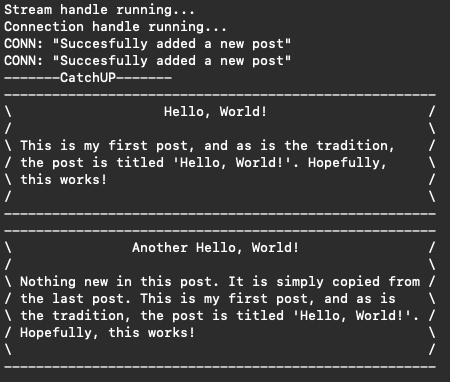
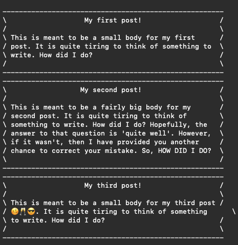
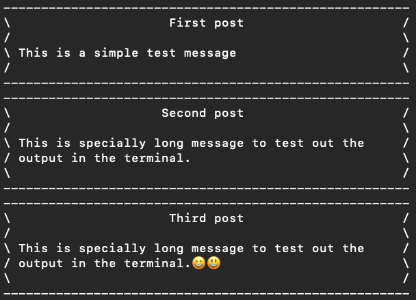
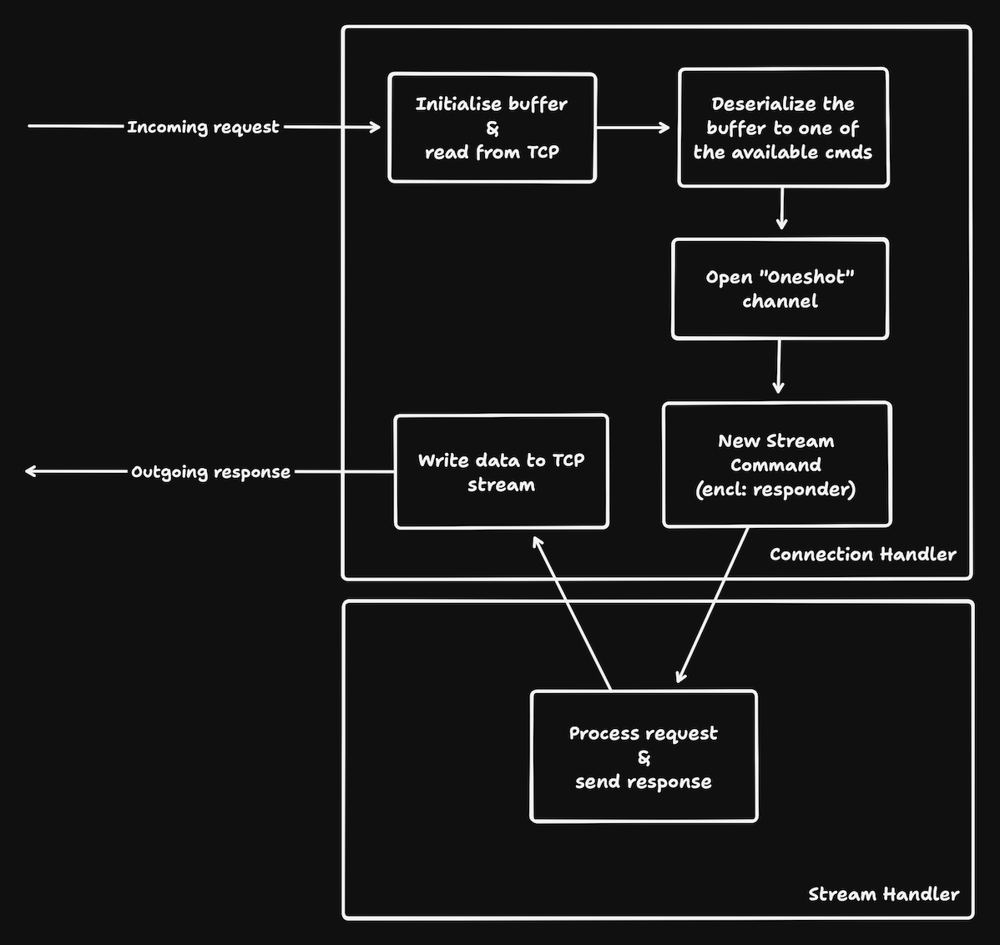

# Brief

## About

Catchup is supposed to be a platform for organisations to share updates, called posts,
and then these posts are viewed using the wasm SDK [WIP] or through integration into
other applications.

This is developed using [Rust](https://www.rust-lang.org/) and uses [sqlite](https://www.sqlite.org/) in the backend.

## Table of Content

- [Issues](#issues)
- [MVP](#mvp)
- [overview](#overview)

## Issues (Bug Tracker)

In order to report any bugs, please open a new issue [here](https://github.com/Coder-RG/catchup/issues).

## MVP

## Overview

TODO:

- [Generate Private key & Certificate](https://www.ibm.com/docs/en/license-metric-tool?topic=certificate-step-1-creating-private-keys-certificates)
- [Setup PKI by Cloudfare](https://blog.cloudflare.com/how-to-build-your-own-public-key-infrastructure/)
- [Let's Encrypt](https://letsencrypt.org/getting-started/)
